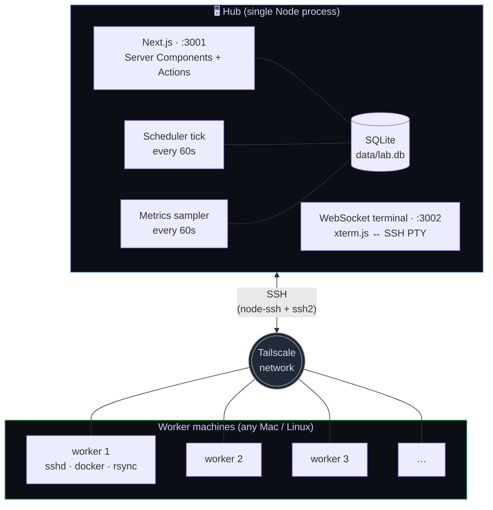

# Lab Fleet

[](LICENSE)
[](https://nextjs.org)
[](https://www.typescriptlang.org)
[](https://tailscale.com)
[](https://sqlite.org)

**A homeserver dashboard for your Tailnet.** Discover machines, dispatch jobs over SSH, schedule recurring work, run a browser terminal per host, monitor live CPU/RAM/disk, install Docker apps from a curated catalog, run HTTP/TCP health checks, and get Discord/Slack/Pushover/macOS alerts — all from a single Node process you run on a Mac mini or Linux box in your office.

> Built on the back of a real-world job: 102 hours of webinar audio crunched in parallel across 4 lab Macs in one weekend, then generalized into something anyone can fork.

---

## Table of contents

- [Why](#why)
- [Architecture](#architecture)
- [Features](#features)
- [Install](#install)
- [Onboarding a new machine](#onboarding-a-new-machine)
- [Built-in templates](#built-in-templates)
- [App catalog](#app-catalog)
- [Run on boot](#run-on-boot)
- [Security model](#security-model)
- [Project layout](#project-layout)
- [Contributing](#contributing)
- [License](#license)

---

---

## Why

Existing tools are either too heavy (Rundeck, SaltStack) or too narrow (Tailscale alone, Portainer alone). Lab Fleet sits in the middle:

- Enough structure to be useful for repeatable work (templates, workflows, schedules, history)
- Few enough moving parts to host on a single Mac mini
- **No agent on workers** — SSH + `docker` + `rsync` is all they need
- **No exposed ports** outside Tailscale

If you've got 2-6 boxes on Tailscale and find yourself constantly opening Terminal windows to do the same things on each, this is for you.

---

## Architecture



**Outbound only.** Workers don't run any agent. The hub keeps a per-machine SSH key, talks to each over Tailscale, and persists state to a local SQLite file. Nothing is exposed to the public internet.

---

## Features

### Control plane

- **🖥 Fleet view** — every Tailscale peer as a card with live CPU sparkline, RAM, disk free, online status
- **💻 Browser terminal** — `xterm.js` + WebSocket → SSH PTY shell per machine, with resize forwarding
- **📤 Drag-and-drop deploy** — drop files or whole folders, rsync to N machines in parallel
- **⚡ Shell-on-fleet** — paste a command, pick targets, see streamed output per machine
- **📋 Job templates** — 5 built-ins + custom; per-kind recipe form (shell command / rsync paths / git repo / app)
- **🔁 Workflows** — sequential template chains with `on-success` / `always` conditions
- **⏰ Cron scheduler** — standard 5-field cron; fires templates OR workflows; retry caps
- **🩺 Health checks** — HTTP / TCP probes on per-check intervals; down/recovery transitions notify
- **🔔 Notifications** — Discord webhook, Slack webhook, Pushover, macOS native banners
- **📊 Per-machine graphs** — CPU + disk timelines (Recharts) with 7-day retention
- **🐳 Docker management** — list / start / stop / restart / rm / logs per container
- **📦 App catalog** — one-click install of Vaultwarden, Pi-hole, Syncthing, Uptime Kuma, Glances, Jellyfin (more via PR)
- **💾 Backups** — SQLite hot snapshots, daily auto, 14-file rotation
- **🧙 New-machine wizard** — automates SACL + SSH key + Homebrew + whisper.cpp into one paste + one click
- **🌗 Light & dark mode** with FOUC-prevention

### Compared to other tools

| | Portainer | Rundeck | Tailscale alone | **Lab Fleet** |
|---|---|---|---|---|
| Docker UI | ✅ | ❌ | ❌ | ✅ |
| SSH job runner | ❌ | ✅ | ❌ | ✅ |
| Cron scheduler | ❌ | ✅ | ❌ | ✅ |
| Browser terminal | ✅ | ❌ | ✅ (Tailscale SSH) | ✅ |
| App catalog | ❌ | ❌ | ❌ | ✅ |
| Notifications | partial | ✅ | ❌ | ✅ |
| Time-series graphs | ❌ | ❌ | ❌ | ✅ |
| No agent on workers | ❌ | ❌ | ✅ | ✅ |
| Single binary deploy | ❌ | ❌ | ✅ | ✅ |
| MIT-licensed | partial | ❌ | ❌ | ✅ |

---

## Install

```bash
git clone https://github.com/fthrvi/fleet.git ~/fleet
cd ~/fleet
npm install
cp .env.example .env       # edit if you want to override defaults
npx prisma db push          # create the SQLite schema
npm run dev                 # http://$(tailscale ip -4):3001
```

Or one-line bootstrap:

```bash
curl -fsSL https://raw.githubusercontent.com/fthrvi/fleet/main/scripts/install.sh | bash
```

The dashboard binds to your Tailscale IP — reachable from any device on your Tailnet, not exposed publicly.

### Requirements

- **Node 20+** on the hub
- **Tailscale** installed on the hub and every worker
- **OpenSSH server** on every worker (System Settings → General → Sharing → Remote Login on macOS; `sudo systemctl enable --now sshd` on Linux)
- **Docker** on workers — only needed for the app catalog + Docker management panel; not for general SSH job dispatch

---

## Onboarding a new machine

1. Make sure the target is on Tailscale and SSH is enabled.
2. In the dashboard, go to `/setup`.
3. Pick the machine from the radio list, enter its SSH username, copy the one-line bootstrap script.
4. Paste the script into the machine's Terminal (via VNC or in person), enter the password when prompted.
5. Tick "BOOTSTRAP_OK", click "Finish setup."

The hub takes over and installs ffmpeg + cmake, copies whisper.cpp + the model (if you want transcription), exchanges SSH keys for the reverse direction, and marks the machine **READY**.

---

## Built-in templates

| Name | Kind | What it does |
|---|---|---|
| `shell-on-fleet` | `shell` | Paste any command, run on selected machines, stream output |
| `rsync-from-hub` | `rsync-from-hub` | Push a folder from the hub to each machine |
| `rsync-to-hub` | `rsync-to-hub` | Pull a folder from each machine back to the hub (with `{machine}` substitution) |
| `git-deploy` | `git-deploy` | Clone or pull a repo, run a build, restart a service |
| `transcribe-mp4s-worker` | `transcribe-mp4s-worker` | Start a whisper-cli worker on a machine pointing at this hub's coordinator |
| `setup-mac-worker` | `setup-mac-worker` | Post-bootstrap automation (called by the `/setup` wizard) |

Custom templates are just rows in the `JobTemplate` table — edit the JSON recipe on `/templates/[id]` to tweak defaults.

---

## App catalog

Curated `docker compose` installs, one click each. Compose templates live in `src/lib/apps/registry.ts` — add a new app by appending a `CatalogApp` entry (PRs welcome).

| App | Category | Default port |
|---|---|---|
| **Vaultwarden** | Productivity | 8088 |
| **Pi-hole** | Networking | 8089 + 53 |
| **Syncthing** | Sync | 8384 + 22000 |
| **Uptime Kuma** | Monitoring | 3010 |
| **Glances** | Monitoring | 61208 |
| **Jellyfin** | Media | 8096 |

After install, the dashboard shows running ports and an "Open :8088" button that points at the worker's Tailscale hostname.

---

## Run on boot

### macOS — LaunchAgent

```bash
cp scripts/launchd-template.plist ~/Library/LaunchAgents/dev.labfleet.hub.plist
# edit YOUR_USERNAME + paths inside
launchctl bootstrap gui/$(id -u) ~/Library/LaunchAgents/dev.labfleet.hub.plist
launchctl print gui/$(id -u)/dev.labfleet.hub
```

### Linux — systemd

```bash
sudo cp scripts/systemd-template.service /etc/systemd/system/lab-fleet.service
# edit User + WorkingDirectory inside
sudo systemctl daemon-reload
sudo systemctl enable --now lab-fleet
journalctl -u lab-fleet -f
```

---

## Security model

- **No exposed ports** outside Tailscale. Dashboard binds to the hub's Tailnet IP only.
- **No password storage.** The wizard generates a bootstrap script you paste on the target; everything after that uses SSH keys.
- **No agent on workers.** Plain `sshd` + `rsync` + `git` + (optionally) `docker`.
- **Notification webhook URLs** are stored in the local SQLite file. Back up `data/` accordingly.
- **Public-key signing** is the only auth method — passphrase-protected keys are supported via `ssh-add --apple-use-keychain` on macOS.

---

## Project layout

```
fleet/
├── README.md, LICENSE, IMPLEMENTATION_PLAN.md, .env.example
├── prisma/schema.prisma          # 13 models
├── data/                         # SQLite + backups + uploads (gitignored)
├── public/theme-init.js          # FOUC prevention
├── scripts/
│   ├── install.sh                # one-line bootstrap
│   ├── launchd-template.plist    # macOS auto-start
│   └── systemd-template.service  # Linux auto-start
└── src/
    ├── instrumentation.ts        # boots scheduler + sampler + WS terminal
    ├── app/                      # 17 routes (see IMPLEMENTATION_PLAN.md)
    ├── components/               # Cards, terminal modal, sparkline, empty states
    ├── lib/                      # db, ssh, tailscale, runners, scheduler, sampler, backup, notify, health, docker, apps
    └── actions/                  # server actions (machines, jobs, templates, workflows, schedules, health, notifications, deploy, apps, backups, setup)
```

For the full feature roadmap and what's left to build, see [IMPLEMENTATION_PLAN.md](IMPLEMENTATION_PLAN.md).

---

## Contributing

Issues and PRs welcome. A few easy starter ideas:

- **Add an app to the catalog** — drop a `CatalogApp` entry in `src/lib/apps/registry.ts`
- **Write a new runner kind** — implement a handler in `src/lib/job-runners.ts` and register it in the `RUNNERS` map
- **Improve the health-check kinds** — add `dns`, `ping`, or `tls-expiry` probes
- **Polish a page** — empty states, sparkline tooltips, mobile UX

Local dev:

```bash
git clone https://github.com/fthrvi/fleet.git
cd fleet
npm install
cp .env.example .env
npx prisma db push
npm run dev:local       # localhost-only — handy for testing without Tailnet
```

---

## License

MIT — see [LICENSE](LICENSE).

Built by [@fthrvi](https://github.com/fthrvi).
